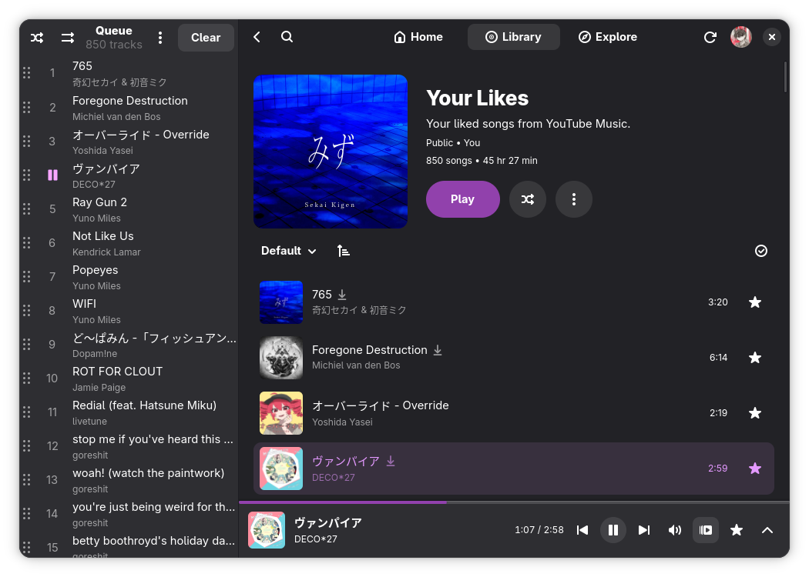
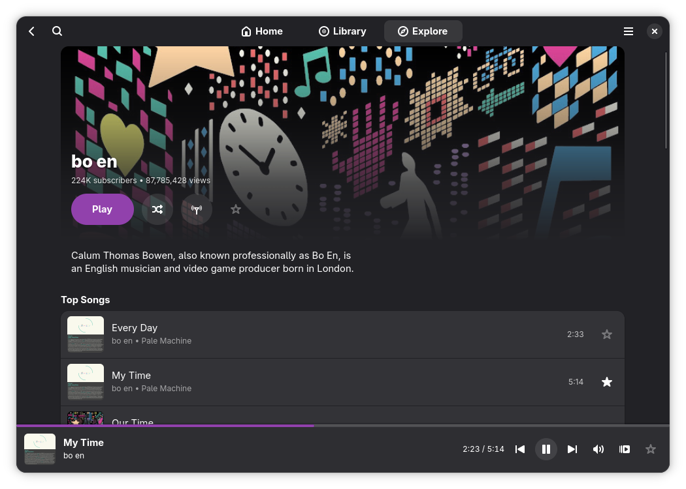
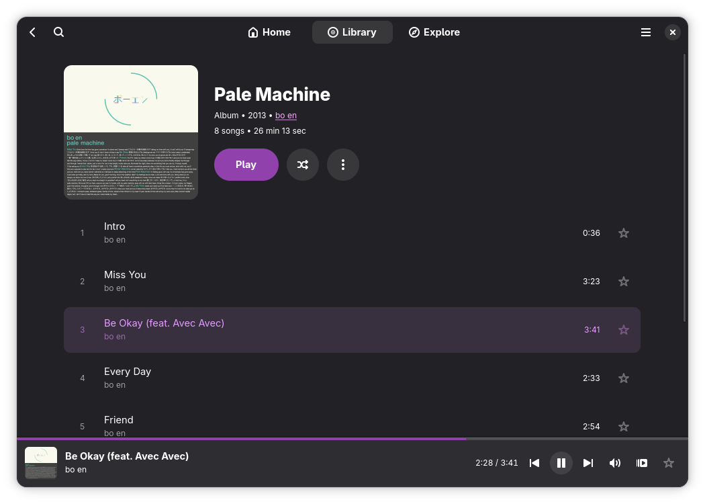
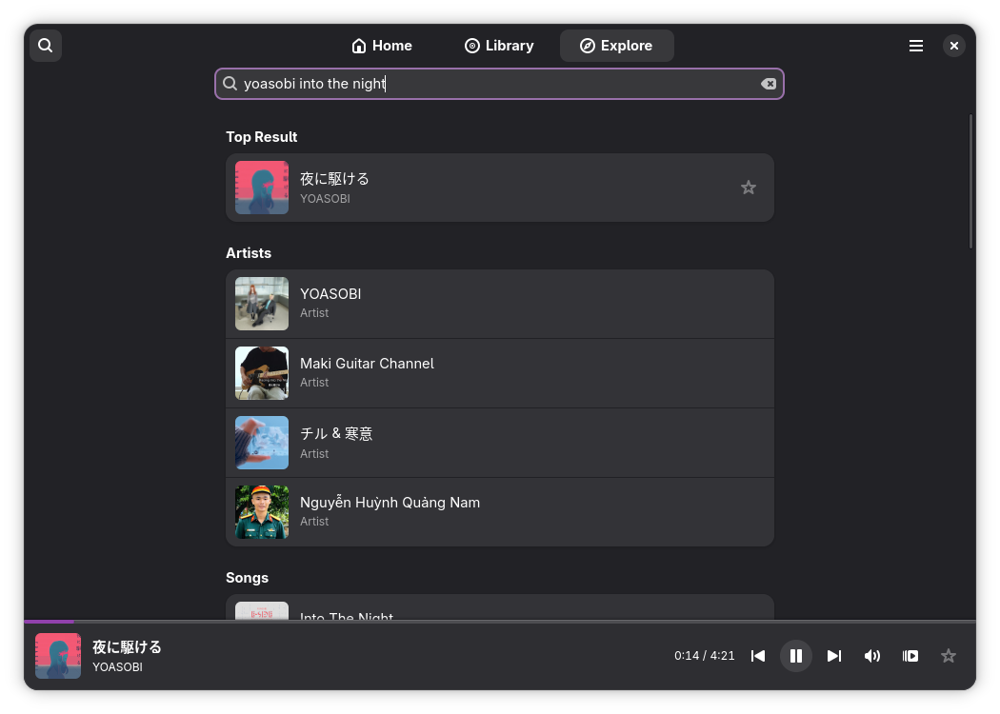
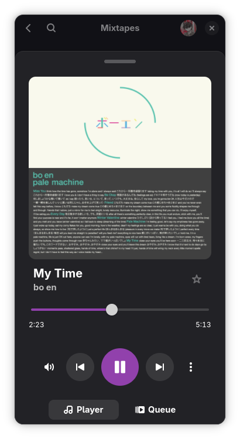
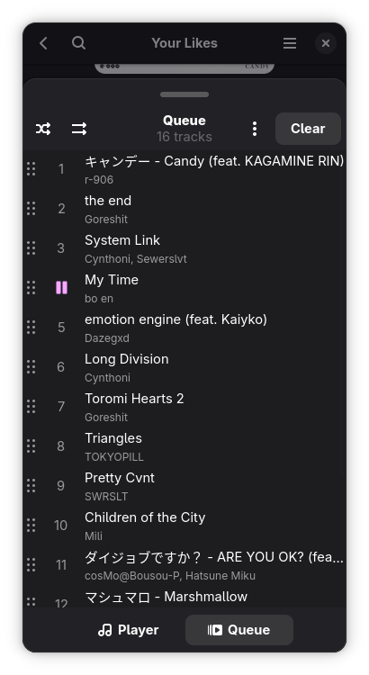
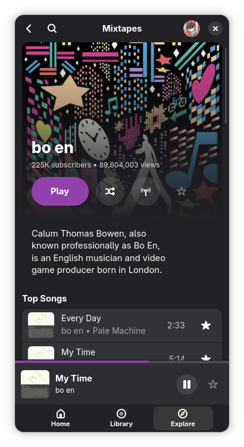
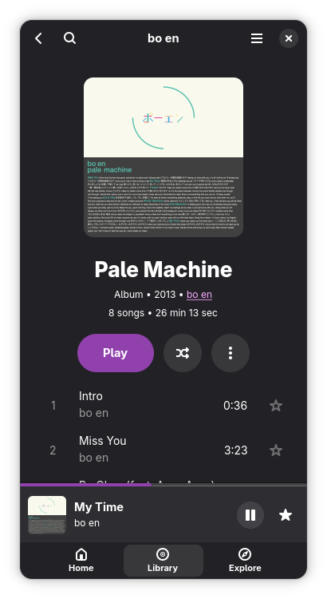

<picture>
  <source media="(prefers-color-scheme: dark)" srcset="screenshots/omori-mixtape-dark.png" />
  <source media="(prefers-color-scheme: light)" srcset="screenshots/omori-mixtape.png" />
  
</picture>

# Mixtapes

A modern, Linux-first YouTube Music player built with GTK4 and Libadwaita.
<br><small>formerly known as Muse</small>

[](LICENSE)
[](https://github.com/m-obeid/Mixtapes/stargazers)
[](https://github.com/m-obeid/Mixtapes/issues)
[](https://aur.archlinux.org/packages/mixtapes-git)
[](https://github.com/m-obeid/Mixtapes/actions/workflows/build-flatpak.yml)
[](https://github.com/m-obeid/Mixtapes/actions/workflows/build-windows.yml)
[](https://nightly.link/m-obeid/Mixtapes/workflows/build-windows/microslop-experiment/mixtapes-windows-x86_64-setup.zip)

<br clear="both"/>

> [!NOTE]
> This software is in alpha. Expect bugs and missing features.
> It is not affiliated with, funded, authorized, endorsed, or in any way associated with YouTube, Google LLC or any of their affiliates and subsidiaries.
> Help is always appreciated -- feel free to open an issue or a pull request!

---

<div align="center">
   
   
  <br/>
     
</div>

---

## Table of Contents

- [Features](#features)
- [Installation](#installation)
- [Authentication](#authentication)
- [Roadmap](#roadmap)
- [Contributing](#contributing)
- [Star History](#star-history)
- [Contributors](#contributors)
- [License](#license)

## Features

- **YouTube Music Integration** -- Connect with your account and access your full library
- **Library Access** -- Playlists, liked songs, artists, albums, and uploads
- **Search & Discovery** -- New releases, moods & moments, genres, trending, and charts
- **Full Playback Control** -- Play/pause, seeking, queue management, shuffle, repeat modes
- **Downloads** -- Download tracks for offline playback as local files
- **MPRIS Support** -- Control playback from system media controls (Linux)
- **Windows SMTC** -- System media transport controls integration (Windows)
- **Radio & Mixes** -- Start a radio station from any song or artist
- **Background Playback** -- Music keeps playing when the window is closed (system tray on Windows)
- **Playlist Editing** -- Reorder, multi-select edit, change covers, visibility, and metadata
- **Caching** -- Cached data for snappy performance
- **Responsive UI** -- Adaptive layout built with Libadwaita

## Installation

### Flatpak (Recommended)

Add the automated repository and install:

```bash
flatpak remote-add --user --if-not-exists mixtapes https://m-obeid.github.io/Mixtapes/mixtapes.flatpakrepo
flatpak install --user mixtapes com.pocoguy.Muse
```

> [!NOTE]
> If you previously installed under the old "Muse" repository name, remove the old remote first:
> `flatpak remote-delete --user mixtapes`

<details>
<summary>Offline bundle install</summary>

Download the latest artifact from [GitHub Actions](https://github.com/m-obeid/Mixtapes/actions), then:

```bash
unzip Mixtapes-x86_64-flatpak.zip
flatpak install --user ./Mixtapes-x86_64.flatpak
```

Both `x86_64` and `aarch64` builds are available.

</details>

### Windows (Experimental)

Download and run the installer: **[MixtapesSetup.exe](https://nightly.link/m-obeid/Mixtapes/workflows/build-windows/microslop-experiment/mixtapes-windows-x86_64-setup.zip)**

A portable (no-install) ZIP is also available from [GitHub Actions](https://github.com/m-obeid/Mixtapes/actions/workflows/build-windows.yml).

> [!NOTE]
> The Windows build is experimental. Known limitations:
> - No embedded WebKit login -- use the bundled Login Helper (`MixtapesLogin.exe`) or `ytmusicapi browser`
> - SMTC (media controls) works but may show "Unknown app" without the installer
> - Font rendering differs from Linux

### AUR (Arch Linux)

```bash
yay -S mixtapes-git
```

### Nix

A Nix flake is available. See [setup instructions](https://github.com/m-obeid/Muse/pull/2#issue-3965386248).

### From Source

<details>
<summary>Install dependencies for your distro</summary>

**Arch Linux:**
```bash
sudo pacman -S git python-pip nodejs gtk4 libadwaita webkitgtk-6.0 gst-plugins-base gst-plugins-good gst-plugins-bad gst-plugins-ugly
```

**Fedora:**
```bash
sudo dnf install git python3 python3-pip nodejs gtk4-devel adwaita-gtk4-devel webkitgtk6.0-devel gstreamer1-plugins-base gstreamer1-plugins-good gstreamer1-plugins-bad gstreamer1-plugins-ugly
```

**Debian/Ubuntu:**
```bash
sudo apt install git python3 python3-pip nodejs libgtk-4-dev libadwaita-1-dev libwebkitgtk-6.0-dev gstreamer1.0-plugins-base gstreamer1.0-plugins-good gstreamer1.0-plugins-bad gstreamer1.0-plugins-ugly
```

> [!NOTE]
> On Debian/Ubuntu, consider using the Flatpak install to avoid outdated packages.

</details>

```bash
git clone https://github.com/m-obeid/Mixtapes.git
cd Mixtapes
python3 -m venv .venv --system-site-packages
source .venv/bin/activate
pip install -r requirements.txt
chmod +x start.sh
./start.sh
```

To update:

```bash
git pull
pip install -r requirements.txt
```

<details>
<summary>Build on Windows (from source)</summary>

Requires [MSYS2](https://www.msys2.org/) with the UCRT64 environment:

```bash
# In MSYS2 UCRT64 terminal:
pacman -S mingw-w64-ucrt-x86_64-gtk4 mingw-w64-ucrt-x86_64-libadwaita \
  mingw-w64-ucrt-x86_64-python mingw-w64-ucrt-x86_64-python-pip \
  mingw-w64-ucrt-x86_64-python-gobject mingw-w64-ucrt-x86_64-gstreamer \
  mingw-w64-ucrt-x86_64-gst-plugins-base mingw-w64-ucrt-x86_64-gst-plugins-good \
  mingw-w64-ucrt-x86_64-gst-plugins-bad mingw-w64-ucrt-x86_64-gst-plugins-ugly \
  mingw-w64-ucrt-x86_64-glib2 mingw-w64-ucrt-x86_64-nodejs \
  mingw-w64-ucrt-x86_64-ffmpeg mingw-w64-ucrt-x86_64-python-pillow git

git clone https://github.com/m-obeid/Mixtapes.git && cd Mixtapes
pip install --break-system-packages -r requirements-windows.txt
pip install --break-system-packages pystray

# Compile GResources and run:
glib-compile-resources --sourcedir=. src/muse.gresource.xml --target=src/muse.gresource
python src/main.py
```

**SMTC bridge** (optional, for Windows media controls):
```bash
# In a regular PowerShell/CMD (not MSYS2), with Rust installed:
cd windows/bridge
cargo build --release
# Copy target/release/MixtapesBridge.exe to windows/ in the app directory
```

**Login helper** (optional, for browser-based login):
```bash
# In a regular PowerShell/CMD with Python 3.12:
pip install pywebview pyinstaller
pyinstaller --onefile --noconsole --name MixtapesLogin windows/login_helper.py
# Copy dist/MixtapesLogin.exe to windows/ in the app directory
```

</details>

<details>
<summary>Build with flatpak-builder</summary>

```bash
flatpak install flathub org.gnome.Platform//49 org.gnome.Sdk//49 org.freedesktop.Sdk.Extension.node24//24.08
git clone https://github.com/m-obeid/Mixtapes.git && cd Mixtapes
flatpak-builder --user --install --force-clean build-dir com.pocoguy.Muse.yaml
flatpak run com.pocoguy.Muse
```

</details>

### Prerequisites

| Dependency | Purpose | Windows |
|---|---|---|
| Python 3.10+ | Core runtime | via MSYS2 |
| Node.js | Required for yt-dlp-ejs (fixes playback issues) | via MSYS2 |
| GTK4 + dev headers | UI toolkit | via MSYS2 |
| Libadwaita + dev headers | GNOME UI components | via MSYS2 |
| WebKitGTK 6.0 + dev headers | Embedded browser for auth | N/A (uses Login Helper) |
| GStreamer plugins (base, good, bad, ugly) | Audio playback | via MSYS2 |
| ffmpeg | Audio muxing for downloads | via MSYS2 |

## Authentication

> [!TIP]
> **Linux:** You can authenticate directly in the app using the built-in WebKit browser -- no manual setup needed!
> **Windows:** Use the bundled Login Helper (Start Menu > Mixtapes > Login Helper) to sign in via Edge WebView2.

<details>
<summary>Manual authentication (legacy)</summary>

This app uses `ytmusicapi` for backend data. Authentication gives access to your library and higher quality streams.

1. Run: `ytmusicapi browser`
2. Follow instructions to log in via your browser and paste the headers. Use a private browser profile so you don't get logged out.
3. The output will be saved as `browser.json`.

**Flatpak users:** Open YouTube Music in your browser, copy request headers as described in the [ytmusicapi docs](https://ytmusicapi.readthedocs.io/en/stable/setup/browser.html), then:

```bash
flatpak run --command=sh com.pocoguy.Muse
mkdir -p ~/data/Muse && cd ~/data/Muse && ytmusicapi browser
```

Paste the headers and press `Ctrl-D`.

Without a `browser.json` file, the app falls back to the unauthenticated API, which may cause playback issues.

</details>

## Roadmap

✅️ = implemented · ☑️ = partially implemented · 🔜 = planned · ❎️ = unlikely

| Status | Feature | Details |
|:---:|---|---|
| ✅️ | **Authentication** | Connect to YouTube Music (Browser cookies) |
| ✅️ | **Library** | ✅️ Playlists<br>✅️ Liked songs<br>✅️ Artists<br>✅️ Albums<br>✅️ Uploads |
| ✅️ | **Search** | Search for songs, albums, and artists |
| ☑️ | **Exploration** | ✅️ New Releases<br>✅️ Moods & Moments<br>✅️ Genres<br>✅️ Trending<br>✅️ Charts<br>🔜 Home Page |
| ✅️ | **Artist Page** | ✅️ Basic info<br>✅️ Related artists<br>✅️ Top tracks<br>✅️ Albums<br>✅️ Singles/EPs<br>✅️ Videos<br>✅️ Play<br>✅️ Shuffle<br>✅️ Subscribe/Unsubscribe |
| ✅️ | **Playlist Page** | ✅️ Info<br>✅️ Tracks<br>✅️ Play<br>✅️ Shuffle<br>✅️ Order<br>✅️ Multi-Selection Editing<br>✅️ Cover Change<br>✅️ Change Visibility<br>✅️ Change Description<br>✅️ Change Name |
| ✅️ | **Album Page** | ✅️ Basic info<br>✅️ Tracks<br>✅️ Play<br>✅️ Shuffle |
| ✅️ | **Player** | ✅️ Play/Pause<br>✅️ Seeking<br>✅️ Volume<br>✅️ Queue (Previous/Next, Reorder, Shuffle, Repeat modes) |
| ✅️ | **Caching** | Cache data to reduce latency |
| ☑️ | **Responsive Design** | Mobile-friendly layout with adaptive UI |
| ✅️ | **MPRIS Support** | Control playback from system media controls |
| ✅️ | **Download Support** | Download tracks for offline playback, even as local files |
| ✅️ | **Radio / Mixes** | Start a radio station from a song or artist |
| ✅️ | **Dedicated Data Directory** | Cookies, cache, etc. in a dedicated directory |
| ✅️ | **Background Playback** | Music keeps playing when the window is closed |
| ✅️ | **AUR** | Available as `mixtapes-git` |
| ☑️ | **Flatpak** | ✅️ Flatpak build<br>☑️ Flathub release (depends on app icon)<br>🔜 App icon |
| ☑️ | **Settings** | Configure app preferences (theme, audio quality, etc.). Not much to configure yet. |
| 🔜 | **Cover Art Tint** | Tint Libadwaita to match cover art, kinda like Material You |
| 🔜 | **Discord RPC** | Show your current track on Discord |
| 🔜 | **Lyrics** | Synchronized lyrics, maybe using BetterLyrics API |
| ✅️ | **Windows** | ✅️ GTK4/Libadwaita via MSYS2<br>✅️ GStreamer playback<br>✅️ SMTC media controls<br>✅️ System tray<br>✅️ Installer<br>✅️ Login helper (Edge WebView2) |
| ❎️ | **macOS** | Unlikely that I will get hands on a Mac anytime soon, so for now won't happen. Technically it's possible to build it for macOS, but I don't have a Mac to test it on. |
| 🔜 | **GNOME Circle** | Still considering it, might not happen |

Have an idea or found a bug? [Open an issue!](https://github.com/m-obeid/Mixtapes/issues)

## Contributing

Contributions are welcome! Feel free to open issues for bug reports or feature requests, and submit pull requests.

## Star History

<a href="https://www.star-history.com/?repos=m-obeid%2FMixtapes&type=date&legend=top-left">
 <picture>
   <source media="(prefers-color-scheme: dark)" srcset="https://api.star-history.com/image?repos=m-obeid/Mixtapes&type=date&theme=dark&legend=top-left" />
   <source media="(prefers-color-scheme: light)" srcset="https://api.star-history.com/image?repos=m-obeid/Mixtapes&type=date&legend=top-left" />
   
 </picture>
</a>

## Contributors

<a href="https://github.com/m-obeid/Mixtapes/graphs/contributors">
  
</a>

## License

This project is licensed under the [GNU General Public License v3.0](LICENSE) or later.
